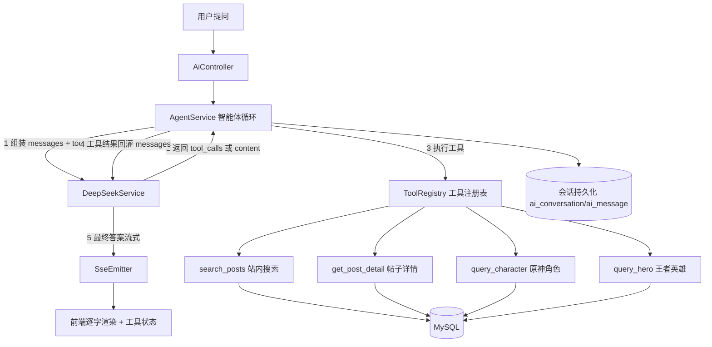
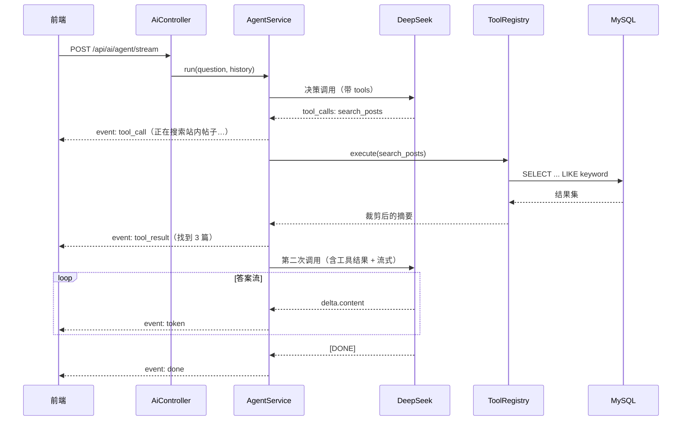
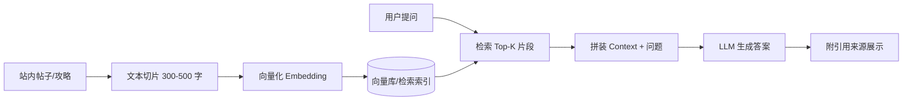

# 智能体（Agent）改造设计方案

> 目标：把现有「LLM 直接调用 + Prompt 工程」升级为**名副其实的社区领域智能体**，使其具备工具调用、检索增强与记忆能力，同时提升论文创新点分量。
> 现状：见 `THESIS_SUMMARY.md` §6.5；当前 `DeepSeekService` 仅做「system prompt + history + question → Chat Completions」，无工具调用、无规划、无长期记忆。

---

## 1. 现状与目标差距

| 能力维度 | 现状 | 目标（智能体） | 改造动作 |
|---|---|---|---|
| 工具调用 | ❌ 无 | ✅ 可查站内帖子/角色数据 | 注册工具 + Function Calling 循环 |
| 检索增强 RAG | ❌ 无 | ✅ 检索站内攻略再生成 | 文档切片 + 向量/全文检索 |
| 记忆 | ⚠️ 前端临时 history（≤20 条，服务端不存） | ✅ 会话持久化 | 新增会话与消息表 |
| 多步推理 | ❌ 单轮 | ✅ 思考—调用—观察循环 | Agent 循环（上限 N 步） |
| 流式输出 | ✅ token 流 | ✅ 增加工具调用状态事件 | SSE 事件扩展 |
| 场景化 Prompt | ✅ 三层 | ✅ 保留并增强 | 注入工具说明 |

---

## 2. 三个改造方案对比

| 方案 | 内容 | 工作量 | 论文价值 | 风险 |
|---|---|---|---|---|
| **A. 工具调用智能体** | Function Calling + 工具循环 + 工具调用可视化 | 小（2–3 天） | 中高：可写"社区领域智能体" | 低 |
| **B. RAG 检索增强** | 站内内容切片/检索 + 引用来源 | 中（3–4 天） | 高：可写"检索增强生成"，且呼应展望 | 中（需选检索方案） |
| **C. 完整 Agent 架构** | Planner + Tool + Memory + RAG 多步自治 | 大（5–7 天） | 最高 | 高（调试复杂、成本高） |

### 推荐路线：**先 A，再 B，C 作为展望**
理由：A 改动集中、风险低、能让"智能体"表述成立；B 与论文展望的 RAG 呼应、分量足；C 成本高且毕设周期可能不够，写在展望里即可。

---

## 3. 方案 A：工具调用智能体（推荐先做）

### 3.1 总体架构



### 3.2 工具集设计（贴合本系统，全部可复用现有 Mapper）

| 工具名 | 说明 | 数据源 | 参数 |
|---|---|---|---|
| `search_posts` | 站内帖子关键词搜索 | `post` 表（PostMapper） | `keyword`, `limit` |
| `get_post_detail` | 获取帖子详情正文 | `post` 表 | `postId` |
| `query_character` | 查询原神角色属性 | `genshin_character` | `name`, `element` |
| `query_hero` | 查询王者英雄 | `wzry_hero` | `name` |
| `get_user_stats` | 查询用户发帖/获赞统计 | `user` + `post` | `userId` |

**工具 Schema 示例（OpenAI/DeepSeek tools 格式）**：

```json
{
  "type": "function",
  "function": {
    "name": "search_posts",
    "description": "在社区内按关键词搜索帖子，返回标题、摘要、作者与链接。用于回答涉及站内攻略、讨论内容的问题。",
    "parameters": {
      "type": "object",
      "properties": {
        "keyword": { "type": "string", "description": "搜索关键词" },
        "limit":   { "type": "integer", "description": "返回条数，默认 5" }
      },
      "required": ["keyword"]
    }
  }
}
```

> **注意**：DeepSeek `deepseek-chat` 支持 Function Calling（兼容 OpenAI `tools` 格式），**实施前请先用一个小样例验证连通性**，以官方最新文档为准。

### 3.3 数据结构扩展（改动点）

`ChatCompletionRequest` 需新增：

```java
private List<Tool> tools;              // 工具定义
private Object toolChoice;             // "auto" / "none" / 指定工具

public static class Tool {
    private String type = "function";
    private Function function;
}
public static class Function {
    private String name;
    private String description;
    private Map<String, Object> parameters; // JSON Schema
}

@Data
public static class Message {
    private String role;          // system/user/assistant/tool
    private String content;
    private List<ToolCall> toolCalls;   // assistant 发起的调用
    private String toolCallId;          // role=tool 时对应 id
    private String name;                // role=tool 时工具名
}
public static class ToolCall {
    private String id;
    private String type = "function";
    private FunctionCall function;      // { name, arguments }
}
```

`ChatCompletionResponse` 需新增：`choices[0].message.toolCalls`、`finishReason`（`tool_calls` / `stop`）。

### 3.4 Agent 循环设计（核心）

```java
// AgentService#run(question, history, onToken, onToolEvent)
List<Message> messages = buildMessages(question, history);   // system + history + user
int step = 0;
while (step++ < MAX_STEPS) {                                  // MAX_STEPS = 3，防止死循环
    ChatCompletionResponse resp = deepSeek.chat(messages, TOOLS); // 决策阶段：非流式（快）
    Message msg = resp.choices.get(0).message;

    if (msg.getToolCalls() == null || msg.getToolCalls().isEmpty()) {
        // 无工具调用 → 直接流式输出最终答案（体验关键）
        streamFinalAnswer(messages, onToken);
        return;
    }
    messages.add(msg);                                        // assistant(tool_calls)
    for (ToolCall call : msg.getToolCalls()) {
        onToolEvent(call.getFunction().getName());            // SSE: event=tool_call
        String result = toolRegistry.execute(call);           // 执行工具（本地查库）
        messages.add(toolMessage(call.getId(), result));      // role=tool 回灌
    }
}
// 达到步数上限 → 用已有上下文生成兜底答案
```

**关键工程细节**：
1. **决策阶段用非流式**：工具调用需拿到完整 `tool_calls`，流式解析成本高；最终答案再走流式，兼顾正确性与体验。
2. **步数上限 3**：防止模型反复调用工具导致死循环与费用失控。
3. **工具结果裁剪**：只回传关键字段（标题/摘要/数值），避免上下文爆炸。
4. **并发与超时**：工具调用设超时（如 3s），失败则返回"工具暂不可用"让模型改用自身知识回答（**降级**）。
5. **限流沿用**：仍受 10 次/分钟限制，建议对"含工具调用"的请求单独计数更严格。

### 3.5 时序图（可直接作论文插图）



### 3.6 SSE 事件扩展

| 事件 | data | 前端表现 |
|---|---|---|
| `tool_call` | `{"name":"search_posts"}` | 显示"🔍 正在检索站内帖子…" |
| `tool_result` | `{"name":"search_posts","summary":"找到 3 篇"}` | 显示检索结果摘要（可折叠） |
| `token` | 答案片段 | 逐字渲染 |
| `done` | `[DONE]` | 结束 |
| `error` | 脱敏信息 | 提示 |

前端 `api/ai.ts` 的 `dispatch()` 增加对 `tool_call` / `tool_result` 的分支处理，`AiChatView` 增加工具状态气泡。

### 3.7 会话持久化（让"记忆"名副其实）

```sql
CREATE TABLE ai_conversation (
  id BIGINT PRIMARY KEY AUTO_INCREMENT,
  user_id BIGINT NOT NULL,
  title VARCHAR(200),
  created_at DATETIME DEFAULT CURRENT_TIMESTAMP,
  INDEX idx_user (user_id)
);

CREATE TABLE ai_message (
  id BIGINT PRIMARY KEY AUTO_INCREMENT,
  conversation_id BIGINT NOT NULL,
  role VARCHAR(20) NOT NULL,          -- user/assistant/tool
  content TEXT,
  tool_calls_json JSON,
  created_at DATETIME DEFAULT CURRENT_TIMESTAMP,
  INDEX idx_conv (conversation_id)
);

CREATE TABLE ai_tool_call (
  id BIGINT PRIMARY KEY AUTO_INCREMENT,
  message_id BIGINT,
  tool_name VARCHAR(64),
  args_json JSON,
  result_summary VARCHAR(500),
  latency_ms INT,
  created_at DATETIME DEFAULT CURRENT_TIMESTAMP
);
```

配套接口：`GET /api/ai/conversations`（列表）、`GET /api/ai/conversations/{id}/messages`（历史）、`DELETE /api/ai/conversations/{id}`。
→ 服务端保存历史后，前端无需再传 20 条 history，且可跨设备续聊。

### 3.8 新增/改动的类

| 类 | 动作 | 说明 |
|---|---|---|
| `dto/deepseek/*` | 改 | 支持 tools / tool_calls |
| `agent/Tool` | 新增 | 工具接口（`getName/getSchema/execute`） |
| `agent/ToolRegistry` | 新增 | 工具注册与执行（含超时、异常） |
| `agent/impl/*Tool` | 新增 | 5 个工具实现 |
| `services/AgentService` | 新增 | 智能体循环 |
| `services/DeepSeekService` | 改 | 增加 `chatWithTools`、`streamChat` |
| `controller/AiController` | 改 | 新增 `/agent/stream`、会话接口 |
| `api/ai.ts` | 改 | 解析新事件 + 会话接口 |
| `AIChatView` / `AiReply` | 改 | 工具状态展示、会话列表 |

---

## 4. 方案 B：RAG 检索增强（第二阶段）

### 4.1 流程



### 4.2 检索方案选型（按你的环境）

| 方案 | 依赖 | 适合度 | 说明 |
|---|---|---|---|
| **① MySQL 全文 + 关键词**（推荐起步） | 现有 MySQL | ★★★★★ | 零新组件；用 `MATCH...AGAINST` 或 `LIKE` 取 Top-K，毕设足够 |
| ② Redis Stack（RedisSearch 向量） | Redis 模块 | ★★★★ | 你已在用 Redis，但需装 Stack 模块 |
| ③ 向量库（Milvus / Qdrant / pgvector） | 新组件 | ★★ | 最专业，但部署成本高 |
| ④ Embedding API + 内存/文件 | 在线 API | ★★★ | 数据量小可行，重启需重建 |

> **建议**：毕设阶段用 **①**（零成本、可演示），论文中说明"采用全文检索实现召回，向量检索作为后续优化方向"；若有余力再上 ②。

### 4.3 数据设计（方案①）

```sql
CREATE TABLE ai_doc_chunk (
  id BIGINT PRIMARY KEY AUTO_INCREMENT,
  post_id BIGINT NOT NULL,
  chunk_index INT,
  content TEXT,
  FULLTEXT INDEX ft_content (content)   -- MySQL 全文索引
);
```
检索：`SELECT post_id, content FROM ai_doc_chunk WHERE MATCH(content) AGAINST(? IN NATURAL LANGUAGE MODE) LIMIT 5`

### 4.4 与工具调用结合（最佳）

把 RAG 封装成一个工具 `search_knowledge`，让模型**自主决定**是否检索——这样 A 与 B 天然融合：

> 工具 `search_knowledge`：检索站内攻略库，返回相关片段与来源帖子链接。

最终答案附上**引用来源**（帖子标题 + 链接），论文中可写"可溯源的检索增强生成"，这是很强的加分点。

---

## 5. 方案 C：完整自治智能体（可选/展望）

组件：
1. **Planner**：意图识别与任务分解（是否需检索、需几步）；
2. **ToolExecutor + 工具注册表**：支持并行工具调用；
3. **Memory**：短期（会话）+ 长期（用户画像：常玩模块、偏好角色）；
4. **Reflection**：生成后自检（是否答非所问、是否需补充检索）；
5. **Guardrails**：敏感词过滤、越权数据隔离。

成本：多轮 LLM 调用 → 延迟与费用上升，需更严格限流与缓存。**建议写进论文展望而非实现**。

---

## 6. 分阶段实施计划

| 阶段 | 内容 | 产出 | 预估 |
|---|---|---|---|
| S0 | 验证 DeepSeek Function Calling 连通性（最小样例） | 确认可行性 | 0.5 天 |
| S1 | 扩展 DTO（tools/tool_calls）+ `ToolRegistry` + 2 个工具 | 后端可调用工具 | 1 天 |
| S2 | `AgentService` 循环 + `/agent/stream` + SSE 新事件 | 智能体可用 | 1 天 |
| S3 | 前端展示工具状态 + 会话持久化（3 张表 + 接口） | 完整体验 | 1 天 |
| S4 | RAG（切片 + 全文检索 + `search_knowledge` 工具 + 引用展示） | 检索增强 | 2–3 天 |
| S5 | 补充测试（TC-41~TC-50 智能体专项）+ 论文章节更新 | 论文素材 | 1 天 |

**验收标准**：提问"社区里关于雷电将军配装的帖子有哪些？" → 智能体自主调用 `search_posts` → 返回答案并附帖子链接。

---

## 7. 论文升级写法

### 7.1 题目与定位升级
- 原：「基于大语言模型的游戏社区平台设计与实现」
- 升级：「**基于工具调用与检索增强的社区智能助手设计与实现**」或保留原题目、在创新点突出智能体。

### 7.2 创新点升级（替换原第 2、3 条）

1. **面向社区领域的工具调用智能体**：将站内帖子、游戏角色、英雄数据封装为结构化工具，模型可自主判断是否需要调用，突破纯参数化知识的时效性与幻觉问题。
2. **可溯源的检索增强生成（RAG）**：检索站内攻略作为上下文，并在答案中附来源链接，提升可信度与可解释性。
3. **会话持久化与记忆管理**：服务端保存多轮会话与工具调用轨迹，支持跨设备续聊与行为审计。
4. SSE 并发治理（保留原第 3 条）。
5. 高频计数聚合与热榜原子重建（保留原第 4、5 条）。

### 7.3 可新增的论文章节
- 6.x **智能体设计与实现**：工具定义（Schema 表）、Agent 循环（流程图）、步数上限与降级策略；
- 6.y **检索增强设计**：切片策略、检索方案对比、引用溯源机制；
- 第 7 章测试新增 **智能体专项用例（TC-41 ~ TC-50）**：工具命中率、步数控制、检索召回、降级路径。

### 7.4 新增论文插图
- 智能体架构图（§3.1）
- 智能体调用时序图（§3.5）
- RAG 流程图（§4.1）

---

## 8. 风险与对策

| 风险 | 对策 |
|---|---|
| 模型不返回 tool_calls（不稳定） | 保留 `/ask` 纯问答通道；Prompt 明示可用工具；失败降级为直接回答 |
| 工具循环死循环 / 费用失控 | `MAX_STEPS=3`；总超时；每用户限流收紧 |
| 工具查询慢拖慢响应 | 工具超时 3s；结果裁剪；热门查询加 Redis 缓存 |
| 工具返回敏感/越权数据 | 工具执行层做权限与字段白名单，仅返回公开字段 |
| 幻觉引用不存在帖子 | 检索结果必须来自真实查询，答案中的链接由后端拼装而非模型生成 |
| 引入新组件增加部署成本 | 优先用现有 MySQL/Redis，避免 Milvus/pgvector |

---

## 9. 需要你决定的两点

1. **做哪个范围**：仅 A（工具调用，最快出成果）/ A+B（推荐，论文分量足）/ A+B+C（周期长）？
2. **检索方案**：MySQL 全文（零成本）/ Redis Stack / 专业向量库？

确认后我可以直接开始写代码（DTO 扩展 → ToolRegistry → AgentService → 接口 → 前端），并同步更新论文文档与测试用例。
